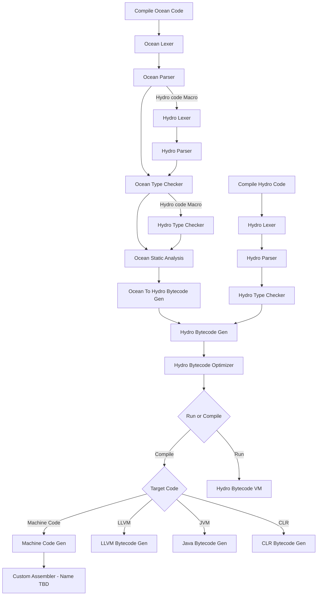

# Ocean Programming Language documentation

This is the language documentation for the OCEAN programming language.

## Compiler Passes Flow

Much of this flow is unimplemented and there will likely be more steps in here. I am kind of thinking it would be beneficial to have more optimize steps throughout the flow since we will have more useful info after certain steps but I will be working on the optimization steps last.

## Tokens

## Formal Parsing Grammar

There is no official parsing grammar. I use a hand written parser that is not restricted to a grammar so that I can add the language features I want. 

I believe this language is already not context-free based on parsing ambiguities between sub-expressions and unnamed tuple syntax. 

## Unimplemented Features

- [ ] match expression / switch statements
  - I have a bunch of ideas I would want and thought it would be complicated to get this started
- [ ] enums
  - I am unsure on how to ahndle declaring an enum
- [ ] Code Gen
  - I want to take the Ocean AST and generate Hydro Bytecode and then generate machine code/LLVM/Java/CLR bytecode from the Hydro byte code
- [ ] Typechecking for imports and multifile support in-general (The syntax is set up but using it is not)
- [ ] Macros
  - Hydro code macros. Need to involve the type checker in this
  - Static analysis macros. Declare that a variable shouldn't have a certain condition at a specific spot
- [ ] Static Analysis
  - After type checking but before code gen I want to add more static analysis
  - Use SA commands in macros
  - Compile Time Reference Counting for code gen
- [ ] Typechecking Improvements
  - There are some complicated typechecking cases that I didn't want to think about or tried to thing about but couldn't think of how to do it.
  - Reference Types
  - Mutable Types
  - Compile Time Types
  - Auto types as generics
    - There are a few things aroung auto types that aren't working completely
- [ ] Standard Library